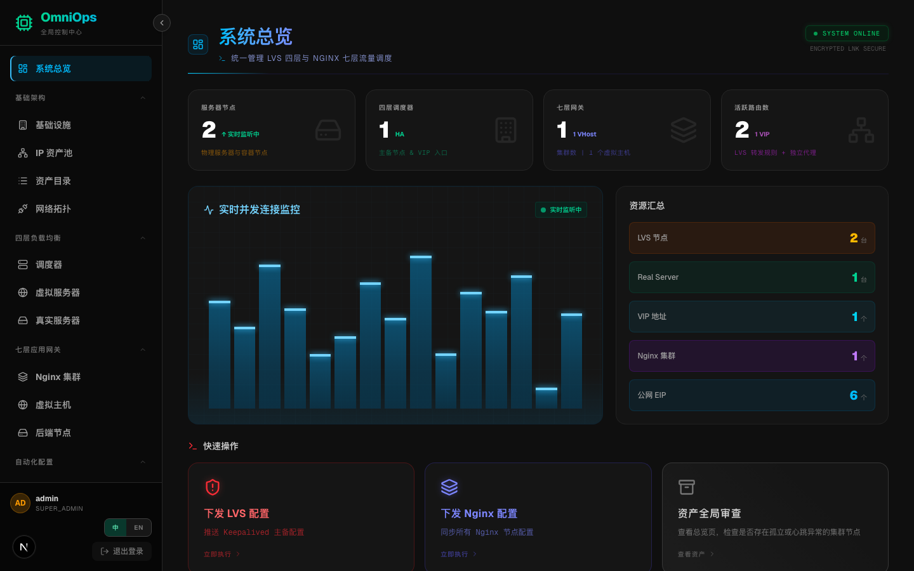
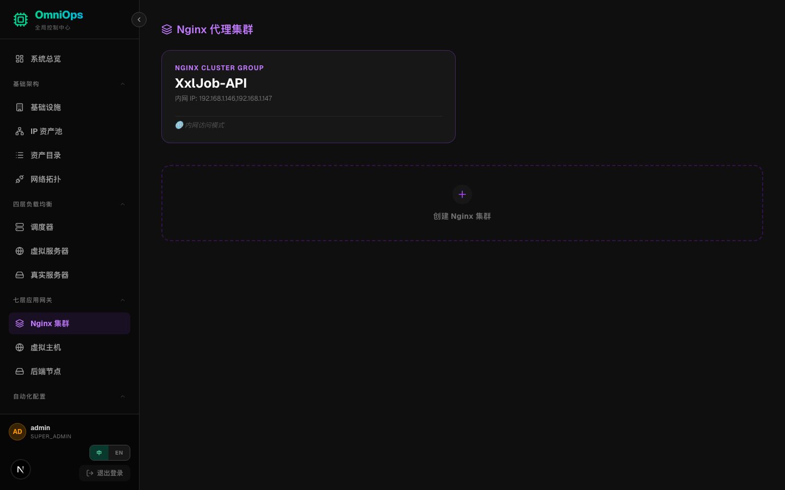
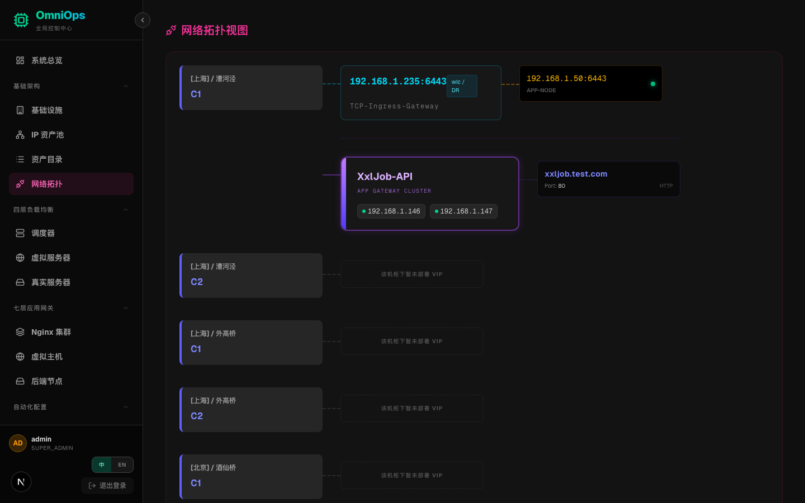
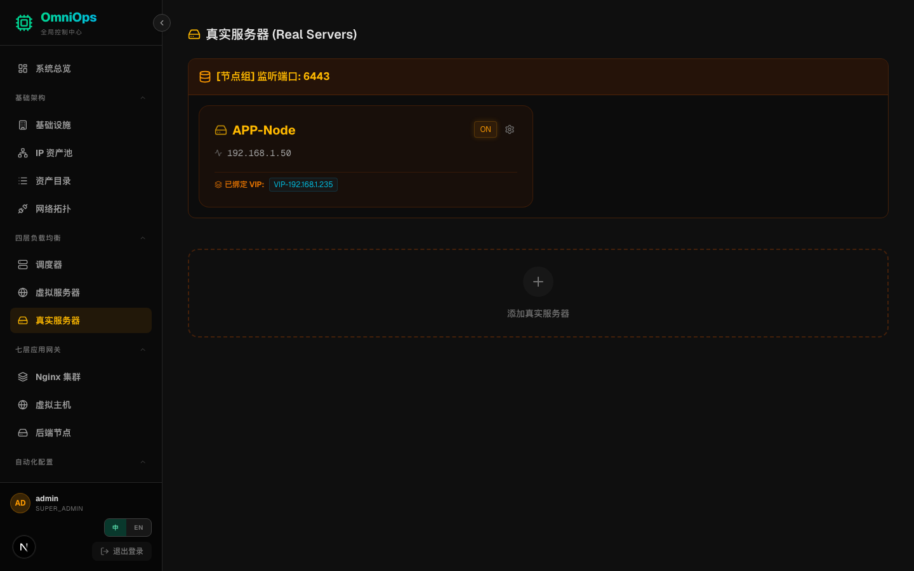
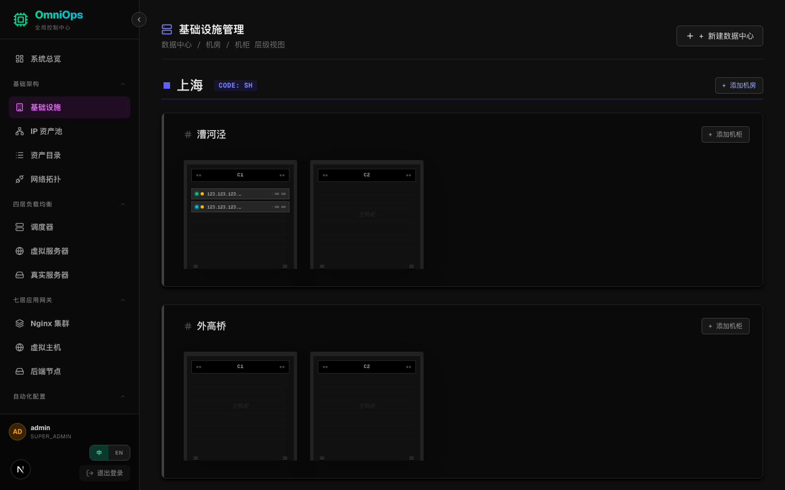
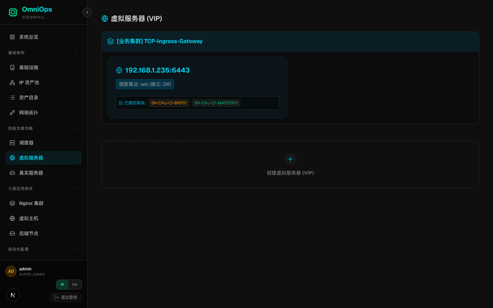
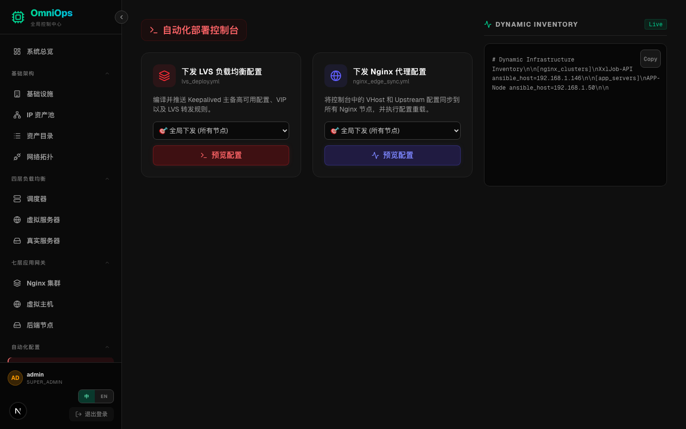

# OmniOps — 全栈运维管理平台

[English](./README_en.md) | [简体中文](./README.md)
> 统一管理 LVS 四层负载均衡、Nginx 七层网关、IP 资产与基础设施的运维控制台

[](LICENSE)
[](https://nextjs.org/)
[](https://fastapi.tiangolo.com/)

---

## 界面预览

| 概览与架构大盘 | 核心资产与基础组件 |
| :---: | :---: |
| <br>系统总览 | <br>七层网关集群 |
| <br>全域架构拓扑 | <br>RS 物理服务器 |
| <br>机房与机柜视图 | <br>VIP 四层调度器 |

<p align="center">
  
  <br><i>Ansible 统一配置下发与操作审计终端</i>
</p>

---

## 功能模块

| 模块 | 说明 |
|------|------|
| **系统总览** | 实时展示服务器节点数、四层调度器、七层网关集群及活跃路由汇总 |
| **LVS 调度器** | 管理 LVS 主备节点（MASTER/BACKUP）、VIP 绑定与 Real Server 权重 |
| **Nginx 集群** | 管理 Nginx 集群、虚拟主机（Server Block）、上游（Upstream）及健康检查 |
| **IP 资产池** | 按类型（公网 EIP / VIP 预留 / 机柜互联）与位置维度管理全量 IP 资产 |
| **基础设施** | 可视化机房机柜拓扑，支持地区 → 机房 → 机柜三层层级管理 |
| **配置下发** | 通过 Ansible 生成并下发 Keepalived / Nginx 配置，支持 Dry-run 预览 |
| **RBAC 权限** | 基于角色的访问控制，支持用户组、角色、权限粒度管理 |

---

## 技术架构

```
OmniOps
├── frontend/          # Next.js 15 + TypeScript 前端
│   ├── src/app/       # 主应用页面（单页应用）
│   └── src/lib/       # i18n 国际化（中/英双语）
└── backend/           # FastAPI + SQLite 后端
    ├── routers/       # 各业务路由模块
    ├── models.py      # ORM 数据模型
    ├── schemas.py     # Pydantic 数据结构
    └── templates/     # Ansible Jinja2 配置模板
```

---

## 快速启动

### 后端

```bash
cd backend
python -m venv venv && source venv/bin/activate
pip install -r requirements.txt
uvicorn main:app --host 0.0.0.0 --port 8000 --reload
```

### 前端

```bash
cd frontend
npm install
npm run dev   # 默认端口 3010（见 next.config.ts）
```

访问 [http://localhost:3010](http://localhost:3010)，默认管理员账号：`admin / password123`

---

## 设计原则

- **暗色优先**：深色主题，适合运维场景长时间使用
- **双语支持**：中英文实时切换，无需刷新
- **权限分层**：`SUPER_ADMIN` → `NETWORK_ADMIN` → `OPS` → `VIEWER` 四级角色
- **安全审计**：配置下发前支持 Dry-run 预览，变更有迹可查

---

## 路线图

- [ ] 系统基线管理（主机合规检查）
- [ ] 系统服务下发（systemd 服务编排）
- [ ] 应用配置下发（多环境配置中心）
- [ ] 告警集成（Prometheus + AlertManager）

---

## 🛠 开发者工具（自动化文档更新）

本系统内置了基于 Playwright 的全域视图自动化捕捉脚本。当您完成 UI 迭代或增加新视图后，无需人工逐一截图，只需要执行以下命令，脚本将**全自动静默唤起浏览器、完成系统登录并重新抓取所有大盘视图**输出至文档目录：

```bash
cd frontend
npm install -D playwright
node capture_all.mjs
```

---

## License

MIT © [jiuchan](https://github.com/jiuchan)
